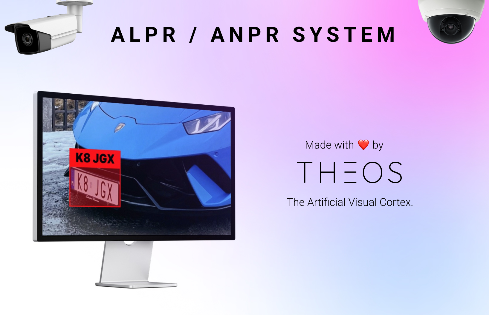

# License Plate Recognition System (ALPR / ANPR)



This is an Automatic License Plate Recognition System built using YOLOv7 in Python, made with ❤️ by [Theos AI](https://theos.ai).

Don't forget to read the [Blog Post](https://blog.theos.ai/articles/how-to-train-yolov7-on-a-custom-dataset-for-license-plate-recognition-in-python-anpr-alpr-tutorial) and watch the [YouTube Video](https://www.youtube.com/watch?v=GVLUVxTpqG0)!

Make sure you have a camera connected to your computer, then run the following commands to start recognizing license plates.

### Install all the dependencies

```
pip install -r requirements.txt
```

### Start the program

```
python run.py
```